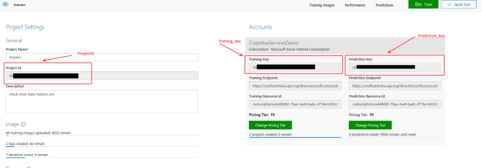
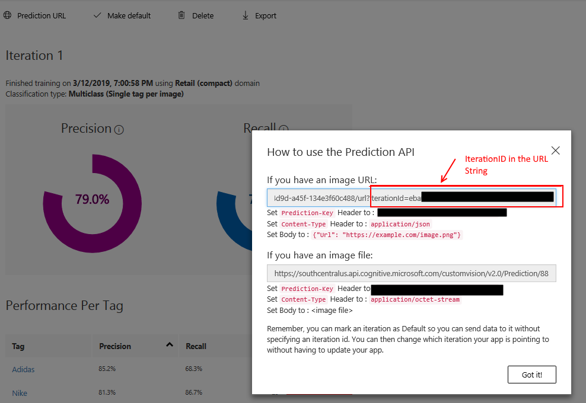

# Using Notebooks to Access CustomVision AI

## Step 1. Install CustomVision AI

You need to install the Azure CognitiveServices - Vision - CustomVision Service

When Using local Python + Jupyter
```
pip install azure-cognitiveservices-vision-customvision
```

When Using [Azure Notebooks](http://notebooks.azure.com)
```
!pip install azure-cognitiveservices-vision-customvision
```
## Step 2. Access your CustomVision Model

```
from azure.cognitiveservices.vision.customvision.training import CustomVisionTrainingClient
from azure.cognitiveservices.vision.customvision.training.models import ImageFileCreateEntry

ENDPOINT = "https://southcentralus.api.cognitive.microsoft.com"

# Replace with a valid keys
training_key = "Insert Training Key"
prediction_key = "Insert Predication Key"
projectid ="Insert Project ID"
iterationid="Insert Iteration ID"
```

You need to add the keys from CustomVision Model



And The iterationID - This is the training iteration under the prediction link on customvision.ai



Finally We want to display the result of a provided image

```
from azure.cognitiveservices.vision.customvision.prediction import CustomVisionPredictionClient

# Now there is a trained endpoint that can be used to make a prediction

predictor = CustomVisionPredictionClient(prediction_key, endpoint=ENDPOINT)

test_img_url ="https://sneakerbardetroit.com/wp-content/uploads/2015/04/nike-free-trainer-5_0-v6-2015-5.jpg"
results = predictor.predict_image_url(projectid, iterationid, url=test_img_url)

# Display the results.
for prediction in results.predictions:
    print ("\t" + prediction.tag_name + ": {0:.2f}%".format(prediction.probability * 100))
```

This can be made much nice with a URL entry box rather than a url image being added directly into the code.

You can download the full [Notebook here](CustomVisionAI.ipynb)
